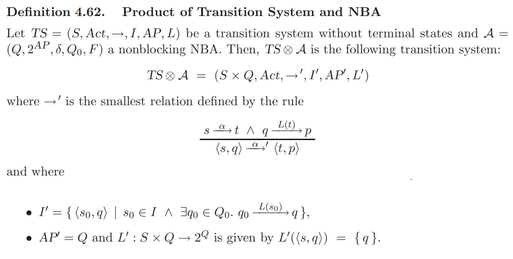

# LTL Model Checking

This is a simple LTL model checker implemented in Python. It takes a TS and some LTL formulae and checks if the TS satisfies the formulae.

## Usage
The current implementation runs `benchmark/TS.txt` and `benchmark/sample.txt`, `benchmark/benchmark.txt` and `benchmark/benchmark1.txt` as the TS and LTL formulae files respectively on default. The input format is in `Input_Format.pdf` at the root of the repository and as follows:

>支持通过文件<TS.txt>输入一个transition system，以及另一个文件<benchmark.txt>输入数个LTL formula，输出transition system（以及各state）是否满足相应LTL formula。

> LTL formula的输入第一行包含两个数A和B，分别表示针对transition system所有初始状态的LTL formula行数A和针对各状态si的LTL formula行数B。其中针对si的LTL formula行的开头为int i。

If you want different systems and checks, put the TS and LTL formulae file into appropriate directories and change the paths in `src/LTL_check.py` accordingly. Then run the following commands:

```
cd src
python3 LTL_check.py
```
And the result will be printed on the console.
```
[1, 1, 0, 0]
[1, 1, 1, 1, 1, 1, 1, 1]
[1, 0, 0, 0, 1, 1, 0, 1, 1, 1]
```
which can be compared with the results in `benchmark/`.
## Implementation
This is an overview of the whole algorithm:

### Parser
`src/Parser.py` contains the parser for the TS and LTL formulae files, and constructs the TS and LTL formulae objects (including closure set and elementary sets) respectively. 
Here is the definition of elementary sets:

To construct elementary sets, the first step is build closure set, which is to recursively parse the formula and add them to the set; then check the rule defined as above and remove bad subsets to get the elementary sets.

### Build GNBA and NBA for LTL formulae
Then we construct GNBA and NBA for the LTL formulae. For future checks, we use the formula's negation, i.e. construct NBA $\mathcal A_{\neg \varphi}$ for $\varphi$.
`src/GNBA.py` contains the GNBA construction algorithm. GNBA is constructed from the LTL's elementary sets. Each elementary set is a state node in GNBA, and the transitions are constructed according to the rules of `NEXT` and `UNTIL` operators.


Because the definition of NBA requires a unique accepting set, we need to convert GNBA to NBA. The conversion algorithm is implemented in `src/NBA.py`. Assume the GNBA contains $k$ accepting sets, then we connect $k$ copies of GNBA to from an NBA. In details, the edges in $i$-th accepting set of the $i$-th GNBA are connected to the next GNBA copy.


Formally, let $\mathcal{A}=\left(Q^{\prime}, \Sigma, \delta^{\prime}, Q_0^{\prime}, F^{\prime}\right)$ where:

$$
\begin{aligned}
& Q^{\prime}=Q \times\{1, \ldots, k\}, \\
& Q_0^{\prime}=Q_0 \times\{1\}=\left\{\left\langle q_0, 1\right\rangle \mid q_0 \in Q_0\right\}, \text { and } \\
& F^{\prime}=F_1 \times\{1\}=\left\{\left\langle q_F, 1\right\rangle \mid q_F \in F_1\right\} .
\end{aligned}
$$

$$
\delta^{\prime}(\langle q, i\rangle, A)= \begin{cases}\left\{\left\langle q^{\prime}, i\right\rangle \mid q^{\prime} \in \delta(q, A)\right\} & \text { if } q \notin F_i \\ \left\{\left\langle q^{\prime}, i+1\right\rangle \mid q^{\prime} \in \delta(q, A)\right\} & \text { otherwise. }\end{cases}
$$

### Product of TS and NBA
The product of TS and NBA is constructed in `src/Product.py`.The product is defined as follows:



The product is a new TS without terminal states. 
Then we can run persistence check algorithm on this product to check if the TS satisfies the LTL formulae.

### Persistence Check
The essence of the persistence check algorithm is to find a reachable cycle in the product using nested DFS. In the product $TS \otimes \mathcal{A}_{\neg \varphi}$, a reachable cycle means that there is a path satisfying the negation of the LTL formula, thus $TS\models \varphi$ fails.
The algorithm is implemented in `src/Product.py` as a method of the product class. The algorithm is as follows:


